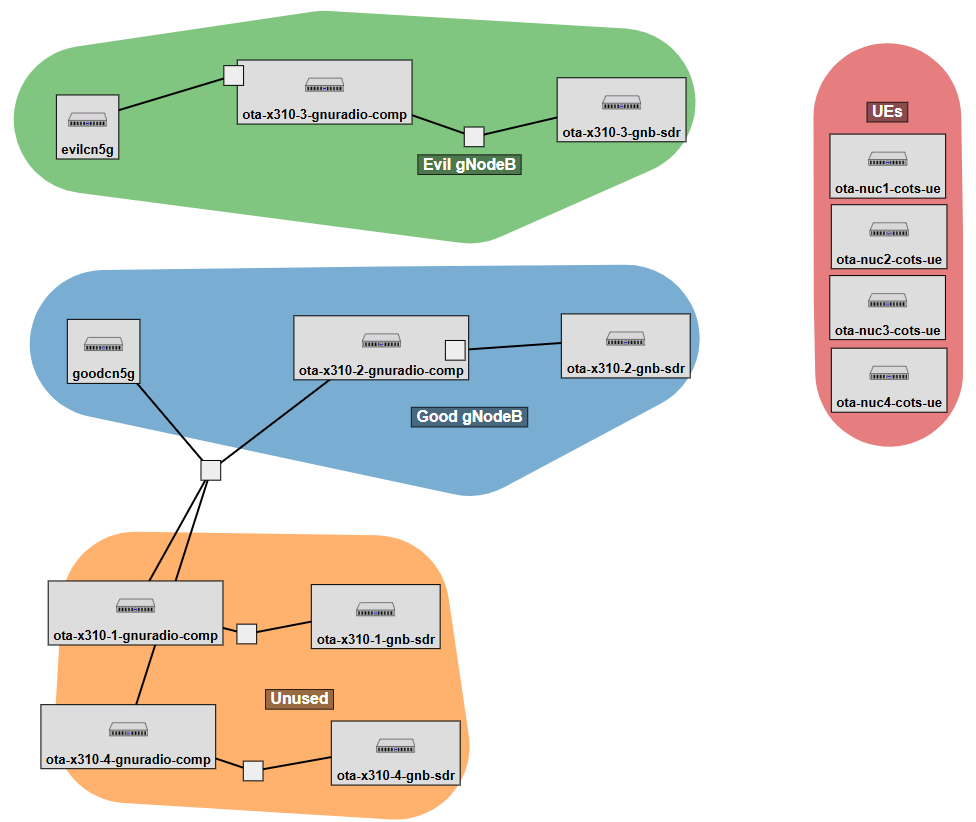
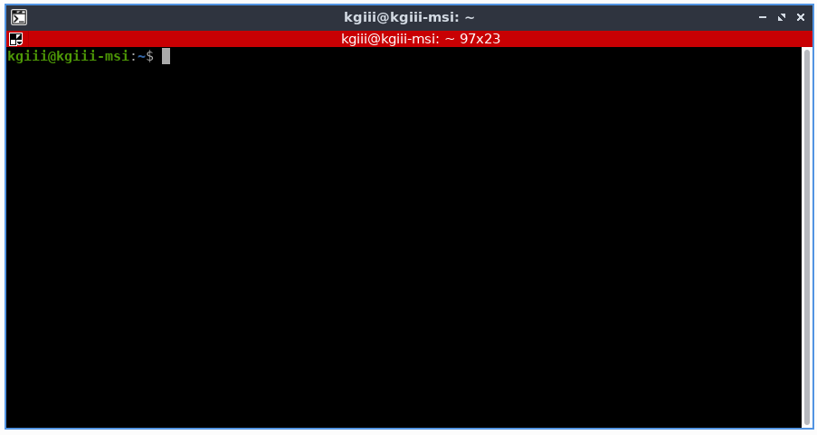

# CS6480-Final-Project
CS6480-Final-Project

Project Members

* Mumtahin Mazumder
* Mike Tomer


# Project overleaf link

https://www.overleaf.com/project/66fb5c7f570d812e548bfae0


# Idea

From the original idea pitch

>Impact of miss-aligned 5G frame structures in supporting diverse applications
>
>Current 5G systems are typically optimized for downlink traffic. I.e.,for providing mobile broadband services to end users, who are typically *downloading* more content than they are uploading.
>
>Emerging 5G applications/services might require a change in that. E.g., remote driving involves significant uplink traffic (i.e., in the form of video and other sensor data used to inform the remote driver), and also requires relatively low latency to ensure the remote driver can take timely actions.
>
>This project will (start to) evaluate the impact of miss-aligned 5G frame structures on adjacent service providers. E.g.,  where one provider is providing downlink heavy (e.g., mobile broadband) services, while a neighbor is providing uplink heavy (e.g., tele-operated driving) services.
>
>A possible starting point would be to instantiate two differently configured 5G networks in adjacent bands in POWDER and to evaluate the impact.


# Plans for implementation

Interface with Dustin Moss 5G expert to figure out how to do stuff on powder


# Project flow (according to professor)

We have off the shelf UEs and RUs.  

tddsystem,  downlink and uplink share

## Project profile

https://github.com/Jester3141/CS6480-Final-Project

A profile called `EvilGNB` has been setup in the `TDDInterfere` project.  Due to instructions from Dustin, we will reserver all the equipment in the lab to run  That is we need the following:

* 4x x310 radios
* 2x Dell r740 servers to connect to the x310s we are using
* 2x Dell r430 servers to connect ot the x310s we are not using (but these will reserve them)
* 4x OTA NUCs with attached x210 radio



# Experiments to run

* Have a neighboring high use channel uploading and a channel downloading.
* high upload on both sides of a downloading channel.


# Things to figure out

* how to instantiate real (not simulated) networks in powder
* How to chose the bands
* Figure out how close we can get them (can we overlap)?


# Documentation of various interfaces

This section describes various interaces

## Getting GNB Metrics

Metrics will be output to the console by default.  

The items received by the stats are described here:  https://docs.srsran.com/projects/project/en/latest/user_manuals/source/console_ref.html#manual-console-ref

Console output will look liek this:

```
          |--------------------DL---------------------|-------------------------UL------------------------------
 pci rnti | cqi  ri  mcs  brate   ok  nok  (%)  dl_bs | pusch  rsrp  mcs  brate   ok  nok  (%)    bsr    ta  phr
   1 4601 |  15   1   21    10k   13    3  18%      3 |  65.5   ovl   26    28k   14    0   0%     53   0us  n/a
   1 4601 |  15   1   27   2.5k    3    0   0%      0 |  65.5   ovl   28   6.5k    4    0   0%      0   0us  n/a
   1 4601 |  15   1    0      0    0    0   0%      0 |   n/a   n/a    0      0    0    0   0%      0   0us  n/a
   1 4601 |  15   1    0      0    0    0   0%      0 |   n/a   n/a    0      0    0    0   0%      0   0us  n/a
   1 4601 |  15   1    0      0    0    0   0%      0 |   n/a   n/a    0      0    0    0   0%      0   0us  n/a
   1 4601 |  15   1    0      0    0    0   0%      0 |   n/a   n/a    0      0    0    0   0%      0   0us  n/a
   1 4601 |  15   1    0      0    0    0   0%      0 |   n/a   n/a    0      0    0    0   0%      0   0us  n/a
   1 4601 |  15   1    0      0    0    0   0%      0 |   n/a   n/a    0      0    0    0   0%      0   0us  n/a
   1 4601 |  15   1    0      0    0    0   0%      0 |   n/a   n/a    0      0    0    0   0%      0   0us  n/a
   1 4601 |  15   1    0      0    0    0   0%      0 |   n/a   n/a    0      0    0    0   0%      0   0us  n/a
   1 4601 |  15   1    0      0    0    0   0%      0 |   n/a   n/a    0      0    0    0   0%      0   0us  n/a
```

* **pci**: Physical Cell Identifier https://www.sharetechnote.com/html/Handbook_LTE_PCI.html
* **rnti**: Radio Network Temporary Identifier (UE identifier) https://www.sharetechnote.com/html/5G/5G_RNTI.html
* **cqi**: Channel Quality Indicator reported by the UE (1-15) https://www.sharetechnote.com/html/Handbook_LTE_CQI.html
* **ri**: Rank Indicator as reported by the UE https://www.sharetechnote.com/html/Handbook_LTE_RI.html
* **mcs**: Modulation and coding scheme (0-28) https://www.sharetechnote.com/html/5G/5G_MCS_TBS_CodeRate.html
* **brate**: Bitrate (bits/sec)
* **ok**: Number of packets successfully sent
* **nok**: Number of packets dropped
* **(%)**: % of packets dropped
* **dl_bs**: Downlink Buffer Status, data waiting to be transmitted as reported by the gNB (bytes)
* **pusch**: PUSCH SINR (Signal-to-Interference-plus-Noise Ratio)
* **rsrp**: Reference Signal Received Power https://www.sharetechnote.com/html/5G/5G_PowerDefinition.html
* **bsr**: Buffer Status Report, data waiting to be transmitted as reported by the UE (bytes) https://www.sharetechnote.com/html/Handbook_LTE_BSR.html
* **ta**: Timing Advance in microseconds https://www.sharetechnote.com/html/5G/5G_TimingAdvance.html
* **phr**: Power Headroom as reported by the UE https://www.sharetechnote.com/html/Handbook_LTE_PHR.html

### GNB Metrics output as JSON file

Before starting the gNB, edit /etc/srsran/gnb.cfg and change the metrics addr to `127.0.0.1`.
This can be done automatically with the command: 
```shell
sudo sed -i 's/addr: 172.19.1.4/addr: 127.0.0.1/g' /etc/srsran/gnb.conf
```
When edited the metrics part of your config file will look like this: 
```yml
metrics:
  autostart_stdout_metrics: true
  enable_json_metrics: true            # Optional BOOLEAN (false). Enables JSON metrics reporting. Supported: [false, true].
  addr: 127.0.0.1                       # Optional TEXT:IPV4 (127.0.0.1). Sets the metrics address. Supported: IPV4 address.
  port: 55555                           # Optional UINT. Sets the metrics UPD port. Supported: [0 - 65535].
```

Once the GNB is running we can connect to the port specified `55555` in the example above and will receive a stream of json objects.  The code below will do this and will output a json list of these metrics dicts to the `gnb_metrics.json` file when it exits.

```python
#!/usr/bin/env python3


import socket
import json
import argparse


if __name__ == "__main__":
    parser = argparse.ArgumentParser(prog='dumpGNodeBStats.py', description='streams in performance metrics from a gnb',)
    parser.add_argument('--ip',         required=True, help="ip address of the host to listen to")
    parser.add_argument('--port',       required=True, type=int, help="the port to connect to")
    parser.add_argument('--outputFile', required=True, help="the file to write the statistics to")
    args = parser.parse_args()

        
    

    UDP_IP = args.ip   # IP address to bind to (localhost in this case)
    UDP_PORT = args.port       # Port to bind to

    # Create a UDP socket
    sock = socket.socket(socket.AF_INET, socket.SOCK_DGRAM)

    # Bind the socket to the IP address and port
    sock.bind((UDP_IP, UDP_PORT))

    print("UDP Receiver started...")

    received_data = []

    try:
        while True:
            # Receive message from the sender
            data, addr = sock.recvfrom(1024)
            
            # Decode the received message as JSON
            try:
                json_data = json.loads(data.decode('utf-8'))
                # Print the received JSON data
                print("Received JSON:", json_data)
                received_data.append(json_data)
            except json.JSONDecodeError:
                print("Received data is not in JSON format:", data.decode('utf-8'))

    except KeyboardInterrupt:
        # Save received data to a file
        filename = args.outputFile
        with open(filename, "w") as file:
            json.dump(received_data, file)
        print(f"Received data saved to {filename}. Exiting...")

# based off of  https://docs.srsran.com/projects/project/en/latest/user_manuals/source/outputs.html#json-metrics
```

The written file will contain a list of json metircs that look like this

```json
{
  "timestamp": 1700671417.005,
  "ue_list": [
    {
      "ue_container": {
        "pci": 1,
        "rnti": 17921,
        "cqi": 15,
        "ri": 1,
        "dl_mcs": 27,
        "dl_brate": 291680.0,
        "dl_nof_ok": 352,
        "dl_nof_nok": 0,
        "dl_bs": 0,
        "pusch_snr_db": 24.025097,
        "ul_mcs": 26,
        "ul_brate": 12838928.0,
        "ul_nof_ok": 431,
        "ul_nof_nok": 0,
        "bsr": 0
      }
    }
  ]
}
```


Need to figure out how to run the EVIL gNB.  Some kind of a boolean flag.  Read the documentation....


## Evil gNodeB

Copy the existing `gnb.conf` to a `gnb_evil.conf`.

In the `amf` section add a line that says `no_core: true`.  This allows the evil GNB operate without a connection to the 5g core

```yml

amf:
  #...
  no_core: true
  #...

```

To enable test mode, add the following section at the end of the file.

```yml
test_mode:
  test_ue:
    rnti: 0x44
    ri: 1 # Set to 2 or 4 for 2 layer or 4 layer MIMO operation
    cqi: 15
    nof_ues: 4
    pusch_active: true
    pdsch_active: true
```

If you have more than one radio attached to the machine, you might also possibly need to reconfigure the radio.

Run `ifconfig` and get the ip address of the x310 radio that you want to use for the gnb.  Then reconfigure the `ru_sdr` section appropriately.

For example, if my 2nd x310 radio had an ip address of `192.168.20.2`, I would modify the device_args to be the correct address

```yml
ru_sdr:
  device_driver: uhd
  device_args: type=n3xx, addr=192.168.20.2,send_frame_size=8000,recv_frame_size=8000
  tx_gain: 50
  rx_gain: 50
  srate:  30.72
  sync: external
  clock: external
  time_alignment_calibration: 0
  lo_offset: 45
```

## Running an experiment

You will need to either be running this from a linux machine or a WSL that is running a X server.

First we need to install required packages with the following 4 commands:
```bash
sudo apt update
sudo apt upgrade -y
sudo apt install -y python3-pip terminator gedit git
sudo pip install ruamel.yaml jsonstream matplotlib
```

Then test to ensure that your X server is started by running:

```bash
terminator
```
That should pop up a terminator window



If you've got all that, in theory your ready to run.

Check out the code and cd into the directory.

```bash
git clone https://github.com/Jester3141/CS6480-Final-Project
cd CS6480-Final-Project/scripts
```

Next, you will need an experiment yaml file.  
```bash
cp experiments.template.yaml myexperiment.yaml
```
Edit this file and provide whatever parameters you desire.  More about this file will be said in the next section.

Launch an experiment with this profile.  Take note of the experiment number from powder.  The is a 6 digit number at the end of the name.  For example if my experiment name was `u0204096-227153`, then `227153` would be my experiment number.

Once the experiment is running and all startup scripts have completed, then you can launch the experiment with the following (Replacing the `<ITEM>` with its corresponding value)
```bash
./launchExperiment.py -u <USERNAME> -n <EXPERIMENT_NAME> -p <PROJECT_NAME> -e <EXPERIMENT_YAML_FILENAME>

# for example
./launchExperiment.py -u u0204096 -n u0204096-227153 -p TDDInterfere -e experiments.withandwithoutevil.yaml
```
Once the test finishes, you will find results in the `<GITCHECKOUTDIR>/results/<DATE>/` folder

## Experiment config file

The experiement yaml file allows you to run 1 or more tests serially (one after the other).  See the `scripts/experiments.template.yaml` for examples of how to use it.

In each test there is a section called `goodGNodeBParameters` and if your using the evil gNodeB a section called `evilGNodeBParameters`.  Items under these section will override the default .yml config files for the good/evil gnb.  The defaults can be found in `scripts/gnb_rf_x310_tdd_n78_40mhz.yml`

### graphs

Output graphs will be able to be defined here.  This functionality has not yet been implemented (nor the yml syntax defined).

TODO

## Other random unorganized thoughts

Which profile? srs-indoor-ota

tdd (Time division Duplexing) parameterization?


Will instantiate 1 normal setup gNBs core with 1 or more UEs connected to the first gNB where measurements will be recorded.  Iperf will be ran on this one with the UEs connected here.

Additionally we will have 1 more gNB in test mode where it is in test mode and constantly transmitting.  This second one allows
us to configure the interference more easily.

UE1-4  ------------ > GNB -> Core

                      Evil GNB


how to get UE metrics?
And IperfD

Knobs GnB are transmit power and the tdd config.  https://gitlab.flux.utah.edu/dmaas/srs-indoor-ota/-/blob/master/etc/srsran/gnb_rf_x310_tdd_n78_40mhz.yml?ref_type=heads

ssh commands need 
-o StrictHostKeyChecking=no

on gnb servers
sudo sysctl -w net.core.wmem_max=24912805

on NUCs install iperf3


In theory can send it to stdin live to modify.

Configuration values discussed on 10/31/2024.
```yml
ru_sdr:
 tx_gain: 50   # will modify this somehow
    clock: external # sets the clock sync to external
    sync: external # sets the clock sync to external


cell_cfg:
  dl_arfcn: 536020                      # Required UINT (536020). Sets the Downlink ARFCN.
  band: auto                            # Optional TEXT (auto). Sets the NR band being used for the cell. If not specified, will be set automatically based on ARFCN. Supported: all release 17 bands.
```