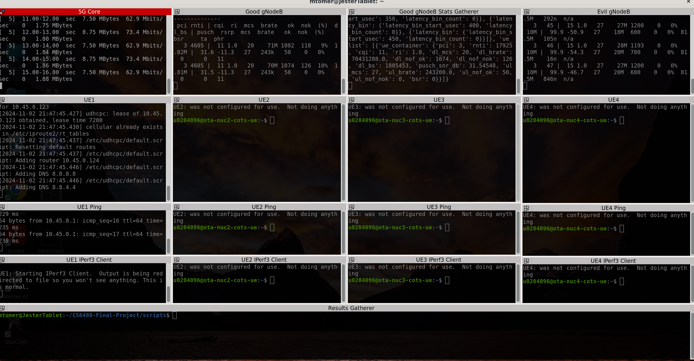
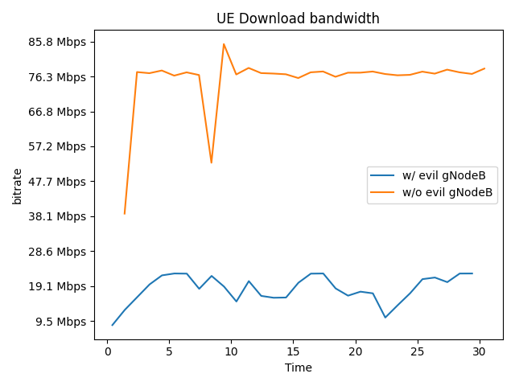

# CS6480-Final-Project
CS6480-Final-Project

Project Members

* Mumtahin Mazumder
* Mike Tomer


# Project overleaf link

https://www.overleaf.com/project/66fb5c7f570d812e548bfae0

Video link explaining how to run the experiment.

https://youtu.be/450AihzAOTs

# Idea

From the original idea pitch

>Impact of miss-aligned 5G frame structures in supporting diverse applications
>
>Current 5G systems are typically optimized for downlink traffic. I.e.,for providing mobile broadband services to end users, who are typically *downloading* more content than they are uploading.
>
>Emerging 5G applications/services might require a change in that. E.g., remote driving involves significant uplink traffic (i.e., in the form of video and other sensor data used to inform the remote driver), and also requires relatively low latency to ensure the remote driver can take timely actions.
>
>This project will (start to) evaluate the impact of miss-aligned 5G frame structures on adjacent service providers. E.g.,  where one provider is providing downlink heavy (e.g., mobile broadband) services, while a neighbor is providing uplink heavy (e.g., tele-operated driving) services.
>
>A possible starting point would be to instantiate two differently configured 5G networks in adjacent bands in POWDER and to evaluate the impact.


# Plans for implementation

Interface with Dustin Moss 5G expert to figure out how to do stuff on powder


# Project flow (according to professor)

We have off the shelf UEs and RUs.  

tddsystem,  downlink and uplink share

## Project profile

https://github.com/Jester3141/CS6480-Final-Project

A profile called `EvilGNB` has been setup in the `TDDInterfere` project.  Due to instructions from Dustin, we will reserver all the equipment in the lab to run  That is we need the following:

* 4x x310 radios
* 2x Dell r740 servers to connect to the x310s we are using
* 2x Dell r430 servers to connect ot the x310s we are not using (but these will reserve them)
* 4x OTA NUCs with attached x210 radio


# Experiments to run

* Have a neighboring high use channel uploading and a channel downloading.
* high upload on both sides of a downloading channel.


# Things to figure out

* how to instantiate real (not simulated) networks in powder
* How to chose the bands
* Figure out how close we can get them (can we overlap)?


# Documentation of various interfaces

This section describes various interaces

## gNodeB Configuration

The gNodeB application can take in one or more yml files with the `-c` flag.  For each setting in the file, it overrides the settings from the previous files.

For example, consider the command:
```bash
sudo /var/tmp/srsRAN_Project/build/apps/gnb/gnb -c /var/tmp/etc/srsran/gnb_rf_x310_tdd_n78_40mhz.yml -c /local/generated/goodGNodeBConfig.yaml
```

The first `-c` sets up all parameters to the default x310 profile contained in `/var/tmp/etc/srsran/gnb_rf_x310_tdd_n78_40mhz.yml`.

The second `-c` only contains:

```yaml
metrics:
  addr: 127.0.0.1
  enable_json_metrics: true
  port: 55555
```
It only overides a few settings.


## Getting GNB Metrics

Metrics will be output to the console by default.  

The items received by the stats are described here:  https://docs.srsran.com/projects/project/en/latest/user_manuals/source/console_ref.html#manual-console-ref

Console output will look liek this:

```
          |--------------------DL---------------------|-------------------------UL------------------------------
 pci rnti | cqi  ri  mcs  brate   ok  nok  (%)  dl_bs | pusch  rsrp  mcs  brate   ok  nok  (%)    bsr    ta  phr
   1 4601 |  15   1   21    10k   13    3  18%      3 |  65.5   ovl   26    28k   14    0   0%     53   0us  n/a
   1 4601 |  15   1   27   2.5k    3    0   0%      0 |  65.5   ovl   28   6.5k    4    0   0%      0   0us  n/a
   1 4601 |  15   1    0      0    0    0   0%      0 |   n/a   n/a    0      0    0    0   0%      0   0us  n/a
   1 4601 |  15   1    0      0    0    0   0%      0 |   n/a   n/a    0      0    0    0   0%      0   0us  n/a
   1 4601 |  15   1    0      0    0    0   0%      0 |   n/a   n/a    0      0    0    0   0%      0   0us  n/a
   1 4601 |  15   1    0      0    0    0   0%      0 |   n/a   n/a    0      0    0    0   0%      0   0us  n/a
   1 4601 |  15   1    0      0    0    0   0%      0 |   n/a   n/a    0      0    0    0   0%      0   0us  n/a
   1 4601 |  15   1    0      0    0    0   0%      0 |   n/a   n/a    0      0    0    0   0%      0   0us  n/a
   1 4601 |  15   1    0      0    0    0   0%      0 |   n/a   n/a    0      0    0    0   0%      0   0us  n/a
   1 4601 |  15   1    0      0    0    0   0%      0 |   n/a   n/a    0      0    0    0   0%      0   0us  n/a
   1 4601 |  15   1    0      0    0    0   0%      0 |   n/a   n/a    0      0    0    0   0%      0   0us  n/a
```

* **pci**: Physical Cell Identifier https://www.sharetechnote.com/html/Handbook_LTE_PCI.html
* **rnti**: Radio Network Temporary Identifier (UE identifier) https://www.sharetechnote.com/html/5G/5G_RNTI.html
* **cqi**: Channel Quality Indicator reported by the UE (1-15) https://www.sharetechnote.com/html/Handbook_LTE_CQI.html
* **ri**: Rank Indicator as reported by the UE https://www.sharetechnote.com/html/Handbook_LTE_RI.html
* **mcs**: Modulation and coding scheme (0-28) https://www.sharetechnote.com/html/5G/5G_MCS_TBS_CodeRate.html
* **brate**: Bitrate (bits/sec)
* **ok**: Number of packets successfully sent
* **nok**: Number of packets dropped
* **(%)**: % of packets dropped
* **dl_bs**: Downlink Buffer Status, data waiting to be transmitted as reported by the gNB (bytes)
* **pusch**: PUSCH SINR (Signal-to-Interference-plus-Noise Ratio)
* **rsrp**: Reference Signal Received Power https://www.sharetechnote.com/html/5G/5G_PowerDefinition.html
* **bsr**: Buffer Status Report, data waiting to be transmitted as reported by the UE (bytes) https://www.sharetechnote.com/html/Handbook_LTE_BSR.html
* **ta**: Timing Advance in microseconds https://www.sharetechnote.com/html/5G/5G_TimingAdvance.html
* **phr**: Power Headroom as reported by the UE https://www.sharetechnote.com/html/Handbook_LTE_PHR.html


### GNB Metrics output as JSON file


To output gNodeB json metrics you will need to set the following settings
```yml
metrics:
  enable_json_metrics: true            # Optional BOOLEAN (false). Enables JSON metrics reporting. Supported: [false, true].
  addr: 127.0.0.1                       # Optional TEXT:IPV4 (127.0.0.1). Sets the metrics address. Supported: IPV4 address.
  port: 55555                           # Optional UINT. Sets the metrics UPD port. Supported: [0 - 65535].
```

Once the GNB is running we can connect to the port specified `55555` in the example above and will receive a stream of json objects.  The code below will do this and will output a json list of these metrics dicts to the `gnb_metrics.json` file when it exits.

```python
#!/usr/bin/env python3


import socket
import json
import argparse


if __name__ == "__main__":
    parser = argparse.ArgumentParser(prog='dumpGNodeBStats.py', description='streams in performance metrics from a gnb',)
    parser.add_argument('--ip',         required=True, help="ip address of the host to listen to")
    parser.add_argument('--port',       required=True, type=int, help="the port to connect to")
    parser.add_argument('--outputFile', required=True, help="the file to write the statistics to")
    args = parser.parse_args()

        
    

    UDP_IP = args.ip   # IP address to bind to (localhost in this case)
    UDP_PORT = args.port       # Port to bind to

    # Create a UDP socket
    sock = socket.socket(socket.AF_INET, socket.SOCK_DGRAM)

    # Bind the socket to the IP address and port
    sock.bind((UDP_IP, UDP_PORT))

    print("UDP Receiver started...")

    received_data = []

    try:
        while True:
            # Receive message from the sender
            data, addr = sock.recvfrom(1024)
            
            # Decode the received message as JSON
            try:
                json_data = json.loads(data.decode('utf-8'))
                # Print the received JSON data
                print("Received JSON:", json_data)
                received_data.append(json_data)
            except json.JSONDecodeError:
                print("Received data is not in JSON format:", data.decode('utf-8'))

    except KeyboardInterrupt:
        # Save received data to a file
        filename = args.outputFile
        with open(filename, "w") as file:
            json.dump(received_data, file)
        print(f"Received data saved to {filename}. Exiting...")

# based off of  https://docs.srsran.com/projects/project/en/latest/user_manuals/source/outputs.html#json-metrics
```

The written file will contain a list of json metircs that look like this

```json
{
  "timestamp": 1700671417.005,
  "ue_list": [
    {
      "ue_container": {
        "pci": 1,
        "rnti": 17921,
        "cqi": 15,
        "ri": 1,
        "dl_mcs": 27,
        "dl_brate": 291680.0,
        "dl_nof_ok": 352,
        "dl_nof_nok": 0,
        "dl_bs": 0,
        "pusch_snr_db": 24.025097,
        "ul_mcs": 26,
        "ul_brate": 12838928.0,
        "ul_nof_ok": 431,
        "ul_nof_nok": 0,
        "bsr": 0
      }
    }
  ]
}
```


Need to figure out how to run the EVIL gNB.  Some kind of a boolean flag.  Read the documentation....


## Evil gNodeB

To enable test mode you must have settings like this

```yml

amf:
  no_core: true

test_mode:
  test_ue:
    cqi: 15
    nof_ues: 4
    pdsch_active: true
    pusch_active: true
    ri: 1
    rnti: 68

```
NOTE: In the `amf` section add a line that says `no_core: true`.  This allows the evil GNB operate without a connection to the 5g core


If you have more than one radio attached to the machine, you might also possibly need to reconfigure the radio.

Run `ifconfig` and get the ip address of the x310 radio that you want to use for the gnb.  Then reconfigure the `ru_sdr` section appropriately.

For example, if my 2nd x310 radio had an ip address of `192.168.20.2`, I would modify the device_args to be the correct address

```yml
ru_sdr:
  device_driver: uhd
  device_args: type=n3xx, addr=192.168.20.2,send_frame_size=8000,recv_frame_size=8000
  tx_gain: 50
  rx_gain: 50
  srate:  30.72
  sync: external
  clock: external
  time_alignment_calibration: 0
  lo_offset: 45
```

## Running an experiment

You will need to either be running this from a linux machine or a WSL that is running a X server.

First we need to install required packages with the following 4 commands:
```bash
sudo apt update
sudo apt upgrade -y
sudo apt install -y python3-pip terminator gedit git
sudo pip install ruamel.yaml jsonstream matplotlib
```

Then test to ensure that your X server is started by running:

```bash
terminator
```
That should pop up a terminator window

{width="400px"}

If you've got all that, in theory your ready to run.

Check out the code and cd into the directory.

```bash
git clone https://github.com/Jester3141/CS6480-Final-Project
cd CS6480-Final-Project/scripts
```

Next, you will need an experiment yaml file.  
```bash
cp experiments.template.yaml myexperiment.yaml
```
Edit this file and provide whatever parameters you desire.  More about this file will be said in the next section.

Launch an experiment with this profile.  Take note of the experiment number from powder.  The is a 6 digit number at the end of the name.  For example if my experiment name was `u0204096-227153`, then `227153` would be my experiment number.

Once the experiment is running and all startup scripts have completed, then you can launch the experiment with the following (Replacing the `<ITEM>` with its corresponding value)
```bash
./launchExperiment.py -u <USERNAME> -n <EXPERIMENT_NAME> -p <PROJECT_NAME> -e <EXPERIMENT_YAML_FILENAME>

# for example
./launchExperiment.py -u u0204096 -n u0204096-227153 -p TDDInterfere -e experiments.withandwithoutevil.yaml
```

The test will run for a while getting everything setup.  After a while it will launch a terminator window.



Once the test finishes, you will find results in the `<GITCHECKOUTDIR>/results/<DATE>/` folder

Please note that the gNodeB configuration files that were used during a test as well as the experiment yaml file
will be copied to the results folder.  This is useful as you can see what settings your results were for.


## Experiment config file

The experiement yaml file allows you to run 1 or more tests serially (one after the other).  See the following files for examples of usage:

The `scripts/experiments.template.yaml` has an example of pretty much all parameters.  One test uses a evil gNodeB and the other doesn't.  The one that does't instantiates 4 UES, where the first one only does one.  Not much experimentation here, but at least shows the syntax.

The `scripts/experiments.withandwithoutevil.yaml` uses a single UE to record download bandwidth.  The only difference
here is one has an evil gNodeB started.

The `scripts/experiments.gaintest.yaml` uses a single UE and runs the experiment many times.  The only difference is the ru_sdr's gain is varied from 1-31 db gain in increments of 2 db for the evil gNodeB.

The `scripts/experiments.arfcntest.yaml` uses a single UE and runs the experiment many times.  The only difference is the center frequency's gain is varied from 1-31 db gain in increments of 2 for the evil gNodeB.

The `scripts/experiments.tddtest.yaml` uses a single UE and runs the experiment many times.  The only difference is the upload and download slots in TDD configuration of the evil gNodeB are varied between them.


### Timings Section

The timing section is required and all parameters in the examples must be present.  If you are not using a UE then the startup delay and packet generation startup delay parameter it required for that UE.  If present for a UE that is not in use, it will be ignored.

```yaml
timings: # these are some delay values before starting up things
    goodGNodeBStartupDelay: 5  # from launch, how long to wait (in seconds) before starting the good gNode B
    evilGNodeBStartupDelay: 30   # from launch, how long to wait (in seconds) before starting the evil gNode B (if configured to use)

    ue1StartupDelay: 10  # from launch, how long to wait (in seconds) before starting UE 1
    ue1PacketGenerationStartupDelay: 30  # How long to wait for startup (ue1StartupDelay + ue1PacketGenerationStartupDelay)
    
    ue2StartupDelay: 12  # from launch, how long to wait (in seconds) before starting UE 2
    ue2PacketGenerationStartupDelay: 30  # How long to wait for startup (ue2StartupDelay + ue2PacketGenerationStartupDelay)
    
    ue3StartupDelay: 14  # from launch, how long to wait (in seconds) before starting UE 3
    ue3PacketGenerationStartupDelay: 30  # How long to wait for startup (ue3StartupDelay + ue3PacketGenerationStartupDelay)
    
    ue4StartupDelay: 16  # from launch, how long to wait (in seconds) before starting UE 4
    ue4PacketGenerationStartupDelay: 30  # How long to wait for startup (ue4StartupDelay + ue4PacketGenerationStartupDelay)
    
    goodGNodeBStatsDumperStartupDelay: 44  # from launch, how long to wait (in seconds) before starting the good gNode B stats dumper.
    settleDelay: 10  # from the start of the gNodeBStatsDumper, how long will it wait before zeroing the timestamp (ie: goodGNodeBStatsDumperStartupDelay + settleDelay is the start of the test)
    dwellDuration: 90 # How long (in seconds) will the iperf generators run for.  In reality the packet generators will run for dwellDuration + settleDelay.
```

### Good gNodeB Experiment section

Everything in the `goodGNodeBParameters` section will be output to a yml and used when starting the good gNodeB.
Items under these section will override the default .yml config files for the good gnb.  The defaults can be found in `scripts/gnb_rf_x310_tdd_n78_40mhz.yml`

```yaml
goodGNodeBParameters:  # everything in here will be added to the good gNodeB's config file
    metrics:
        addr: 127.0.0.1
        port: 55555
        enable_json_metrics: true
```

### Evil gNodeB Experiment section

Everything in the `evilGNodeBParameters` section will be output to a yml and used when starting the evil gNodeB.
Items under these section will override the default .yml config files for the evil gnb.  The defaults can be found in `scripts/gnb_rf_x310_tdd_n78_40mhz.yml`
```yaml
useEvilGNodeB: true # whether or not to start the evil gNodeB
evilGNodeBParameters:  # everything in here will be added to the evil gNodeB's config file
    metrics:
        addr: 127.0.0.1
        port: 55556
        enable_json_metrics: true
    amf:
        no_core: true
    test_mode:
        test_ue:
            rnti: 0x44
            ri: 1 # Set to 2 or 4 for 2 layer or 4 layer MIMO operation
            cqi: 15
            nof_ues: 4
            pusch_active: true
            pdsch_active: true
```
or if not using the evil gNodeB
```yaml
useEvilGNodeB: false # whether or not to start the evil gNodeB
```

### UE(s) experiment section
In the UEs section you may indicate that you want to use between 1 and 4 UES.
```yaml
uesToUse:  # Use one or more UEs.  Just use the lower numbers first.
    - 1
    - 2
    - 3
    - 4
```


### graphs

The graphs section allow you to indicate that you would like 1 or more graphs output to disk.  They will be put in the ```<RESULTS>/graphs``` subfolder.

For example,  The `experiments.gaintest.yaml` experiment runs 5 tests with various gains.  We would like to see the difference between them in graph form.  Therefore we add a section like this:

```yaml
graphs:
    - graph1:
        filename: testplot.png
        graphTitle: UE Download bandwidth
        xaxisLabel: Time
        yaxisLabel: bitrate
        yaxisType: bytes # optional param.  If bytes, will display y axis in MB/s type format
        legendLocation: best # optional param.  default: best.  Valid options are the location string defined here: https://matplotlib.org/3.1.1/api/_as_gen/matplotlib.pyplot.legend.html
        plots:
            - plot1:
                plotName: evil gNodeB gain 10
                # all graphs are plotted with time on the x axis
                plotParameter: test1|UE1|bits_per_second
            - plot2:
                plotName: evil gNodeB gain 20
                # all graphs are plotted with time on the x axis
                plotParameter: test2|UE1|bits_per_second
            - plot3:
                plotName: evil gNodeB gain 30
                # all graphs are plotted with time on the x axis
                plotParameter: test3|UE1|bits_per_second
            - plot4:
                plotName: evil gNodeB gain 40
                # all graphs are plotted with time on the x axis
                plotParameter: test4|UE1|bits_per_second
            - plot5:
                plotName: evil gNodeB gain 50
                # all graphs are plotted with time on the x axis
                plotParameter: test5|UE1|bits_per_second
```
This indicates that we are going to have a single output graph with 5 plots on that graph.

When specifying the `plotParameter`, UE items are specified in this format:

```
<TESTNAME>|<UENAME>|<PARAMETER>
```
In the above example I am graphing `bits_per_second` for `UE1` for each of the tests that were ran.

For gNodeB stats, the format is slighly more complicated as it has total status (total for all UEs) and per UE stats.
```
<TESTNAME>|GoodGNodeB|<UENAME>|<PARAMETER>
<TESTNAME>|GoodGNodeB|<TOTAL_PARAMETER>
```

For example if I wanted to plot the `total_dl_brate` for all UEs in `test1`, I would use `test1|GoodGNodeB|total_dl_brate`.  

If I wanted the `dl_brate` for `UE1` in `test1`, I would use `test1|GoodGNodeB|UE1|dl_brate`




## Other random unorganized thoughts

Please ignore everything below here as It is random musing and notes.

tdd (Time division Duplexing) parameterization?


Knobs GnB are transmit power and the tdd config.  https://gitlab.flux.utah.edu/dmaas/srs-indoor-ota/-/blob/master/etc/srsran/gnb_rf_x310_tdd_n78_40mhz.yml?ref_type=heads


In theory can send it to stdin live to modify.

Configuration values discussed on 10/31/2024.
```yml
ru_sdr:
 tx_gain: 50   # will modify this somehow
    clock: external # sets the clock sync to external
    sync: external # sets the clock sync to external


cell_cfg:
  dl_arfcn: 536020                      # Required UINT (536020). Sets the Downlink ARFCN.
  band: auto                            # Optional TEXT (auto). Sets the NR band being used for the cell. If not specified, will be set automatically based on ARFCN. Supported: all release 17 bands.
```

Useful arfcn calculator:  https://5g-tools.com/5g-nr-arfcn-calculator/


# Notes:

Might want to do a tcp dump?  Also could do it using UDP, but will have to pick a transmission rate.


New gap evaluation test.

Potentially checking power levels.  More samples around the overlap frequencies (maybe 1MHz or smaller?)

Fix colors

Test mode mostly 