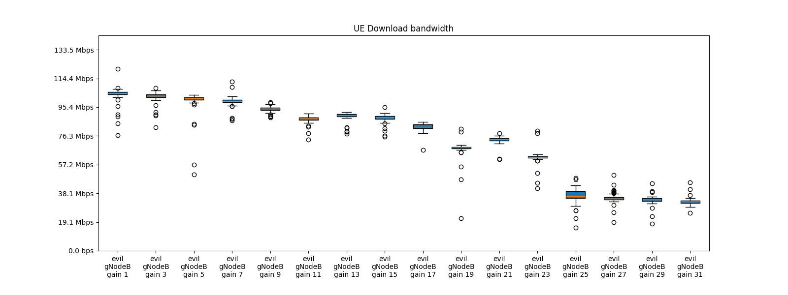
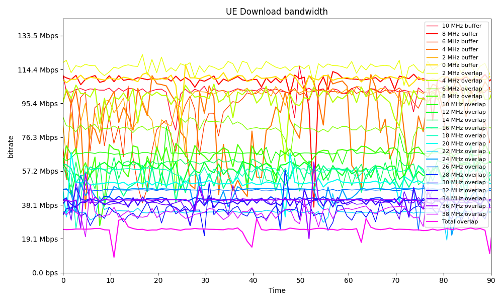
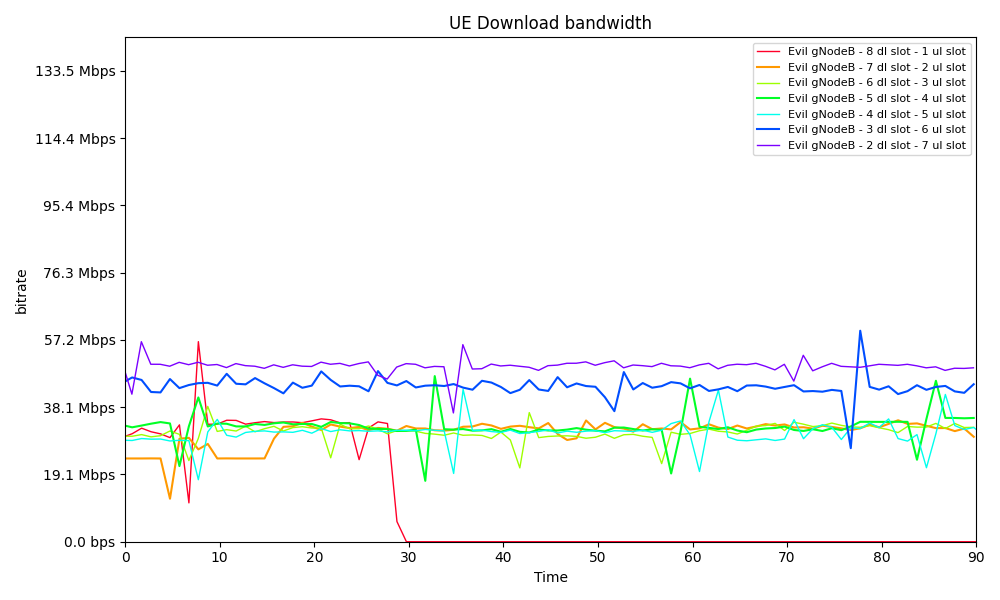
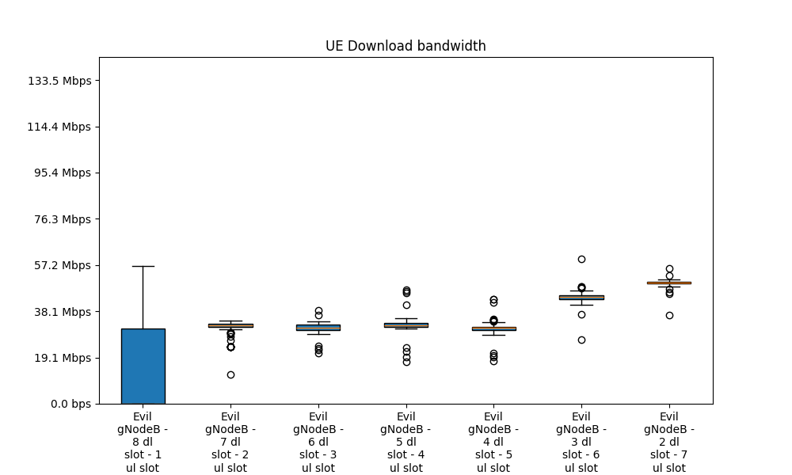
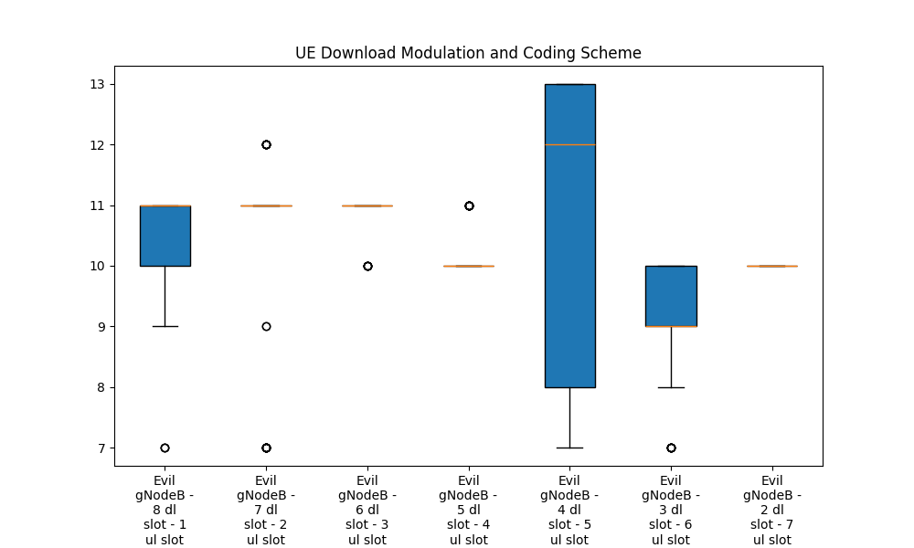
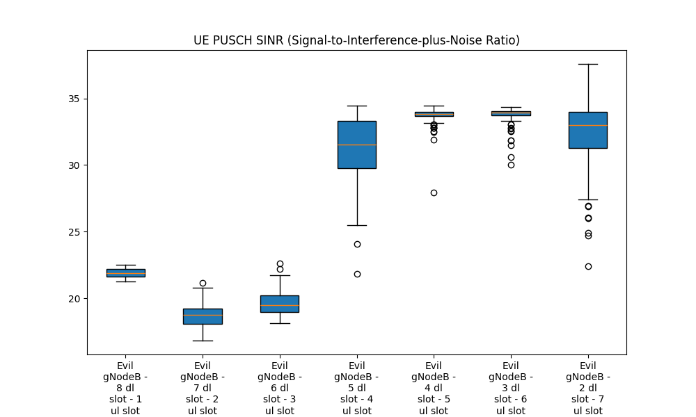
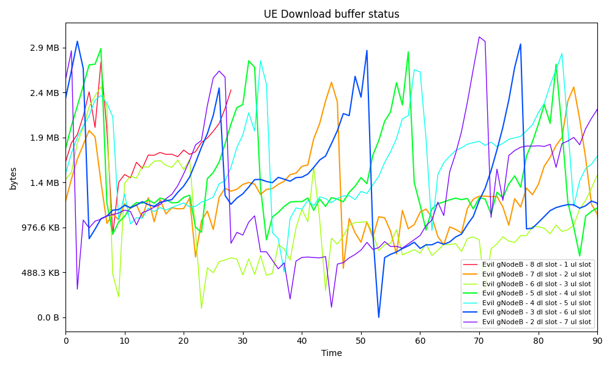
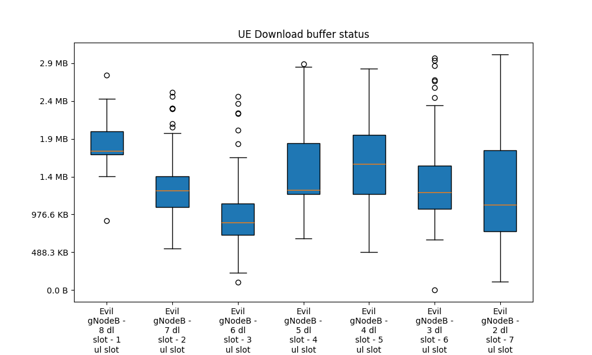
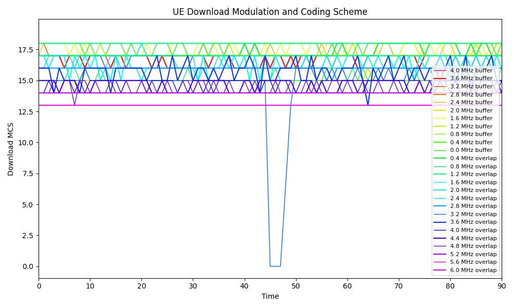
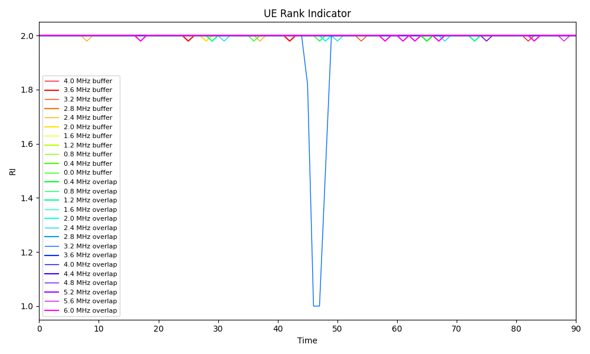

I was able to get another full run today of the various experiments (with one new one).  Some of the big differences here are 
1: I got matplotlib to stop reusing colors.  
2: I am letting iperf3 run for 10 seconds to let results stabilize.  This explains why theses results miss the ramp up at the beginning
3: I am now running each test for 90 seconds

Here are the results (so you can pour over them before we meet on Thursday):

# Experiment #1 (Gain Test)

In this experiment, the good GNode B has a gain of 31 db.  The evil GNodeB's gain is varied from 1 db to 31 db in 2db increments.  No other parameters changed.

#### Experiment #1 (Gain Test) - Download Bandwidth

#### Experiment #1 (Gain Test) - CQI

#### Experiment #1 (Gain Test) - MCS

#### Experiment #1 (Gain Test) - PUSCH SINR

#### Experiment #1 (Gain Test) - Rank Indicator

#### Experiment #1 (Gain Test) - DL Buffer Status

# Experiment #2 (Center Frequency Test)
In this test, the only change is the dl_arfcn values.  Test runs with the default 40MHz bandwidth.  The Good gNodeB runs with a center frequency of 3450 MHz (3430 MHz - 3470 MHz).  The Evil gNodeB starts at 3400 MHz (3380 MHz - 3420MHz) which has a buffer from the good gNodeB of 10MHz.  Then the evil gNodeB's center frequency is adjusted by 2 MHz for each subsequent test towards the good gNodeB's center frequency until they are totally overlapping.  Please note for these plots there is a lot of data.  The box plot gives a better idea.

#### Experiment #2 (Center Frequency Test) - Download Bandwidth

#### Experiment #2 (Center Frequency Test) - CQI

#### Experiment #2 (Center Frequency Test) - MCS

#### Experiment #2 (Center Frequency Test) - PUSCH SINR

#### Experiment #2 (Center Frequency Test) - Rank Indicator

Experiment #2 (Center Frequency Test) - DL Buffer Status

# Experiment #3 (TDD Misconfiguration Test)
In this experiment, the TDD configuration for the good gNodeB uses the default 5 download and 4 upload slots (total 9 slots).  The evil gNodeB's TDD configuration is varied, running each allocation of the ul and download slots (8dl and 1ul, 7dl and 2ul, .....)

#### Experiment #3 (TDD Misconfiguration Test) - Download Bandwidth

#### Experiment #3 (TDD Misconfiguration Test) - CQI

#### Experiment #3 (TDD Misconfiguration Test) - MCS

#### Experiment #3 (TDD Misconfiguration Test) - PUSCH SINR

#### Experiment #3 (TDD Misconfiguration Test) - Rank Indicator

#### Experiment #3 (TDD Misconfiguration Test) - DL Buffer Status

# Experiment #4 (Center Frequency Test - testing the gap)
In this test, the only change is the dl_arfcn values.  Test runs with the default 40MHz bandwidth.  The Good gNodeB runs with a center frequency of 3450 MHz (3430 MHz - 3470 MHz).  The Evil gNodeB starts at 3406 MHz (3380 MHz - 3420MHz) which has a buffer from the good gNodeB of 10MHz.  Then the evil gNodeB's center frequency is adjusted by 0.4 MHz for each subsequent test towards the good gNodeB's center frequency until it hits 3416.  Please note for these plots there is a lot of data.  The box plot gives a better idea.

#### Experiment #4 (Center Frequency Test) - Download Bandwidth

#### Experiment #4 (Center Frequency Test) - CQI

#### Experiment #4 (Center Frequency Test) - MCS

#### Experiment #4 (Center Frequency Test) - PUSCH SINR

#### Experiment #4 (Center Frequency Test) - Rank Indicator

#### Experiment #4 (Center Frequency Test) - DL Buffer Status

Hopefully all these numbers seem reasonably sane to you.

Mike