I re-ran all experiments.  This time the big change is using UDP.  I set the UDP target to 150M in iperf.   This results in much more consistent results.  As before I'm running the gain and tdd tests with various amounts frequency overlap (10MHz buffer, no buffer or overlap, 5MHz overlap, 10MHz overlap, 20MHz overlap, and full overlap)

    
Here are the results (so you can pour over them before we meet on Thursday???):

---

# Experiment #1 (Gain Test)

In this experiment, the good GNode B has a gain of 31 db.  The evil GNodeB's gain is varied from 1 db to 31 db in 2db increments.  Channel bandwidth is 40MHz.  Various frequency overlap between the Good and Evil gNodeBs.  No other parameters changed.

---
#### Experiment #1 (Gain Test) (Full Overlap) - Download Bandwidth
Full Overlap         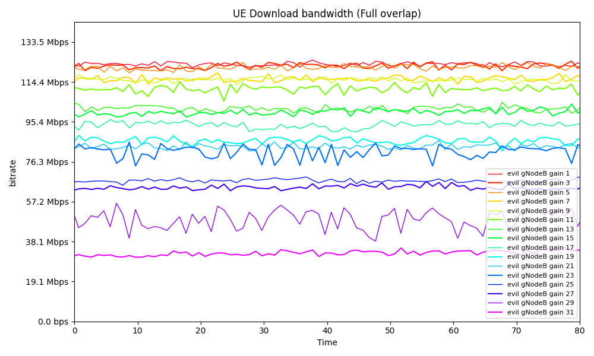
20 Mhz Overlap       
10 Mhz Overlap       
 5 Mhz Overlap       
No Overlap or Buffer 
10 Mhz Buffer        

Full Overlap         
20 Mhz Overlap       
10 Mhz Overlap       
 5 Mhz Overlap       
No Overlap or Buffer 
10 Mhz Buffer        

---
#### Experiment #1 (Gain Test) - CQI
Full Overlap         
20 Mhz Overlap       
10 Mhz Overlap       
 5 Mhz Overlap       
No Overlap or Buffer 
10 Mhz Buffer        

Full Overlap         
20 Mhz Overlap       
10 Mhz Overlap       
 5 Mhz Overlap       
No Overlap or Buffer 
10 Mhz Buffer        

---
#### Experiment #1 (Gain Test) - MCS
Full Overlap         
20 Mhz Overlap       
10 Mhz Overlap       
 5 Mhz Overlap       
No Overlap or Buffer 
10 Mhz Buffer        

Full Overlap         
20 Mhz Overlap       
10 Mhz Overlap       
 5 Mhz Overlap       
No Overlap or Buffer 
10 Mhz Buffer        

---
#### Experiment #1 (Gain Test) - PUSCH SINR
Full Overlap         
20 Mhz Overlap       
10 Mhz Overlap       
 5 Mhz Overlap       
No Overlap or Buffer 
10 Mhz Buffer        

Full Overlap         
20 Mhz Overlap       
10 Mhz Overlap       
 5 Mhz Overlap       
No Overlap or Buffer 
10 Mhz Buffer        

---
#### Experiment #1 (Gain Test) - Rank Indicator
Full Overlap         
20 Mhz Overlap       
10 Mhz Overlap       
 5 Mhz Overlap       
No Overlap or Buffer 
10 Mhz Buffer        

Full Overlap         
20 Mhz Overlap       
10 Mhz Overlap       
 5 Mhz Overlap       
No Overlap or Buffer 
10 Mhz Buffer        

#### Experiment #1 (Gain Test) - DL Buffer Status
Full Overlap         
20 Mhz Overlap       
10 Mhz Overlap       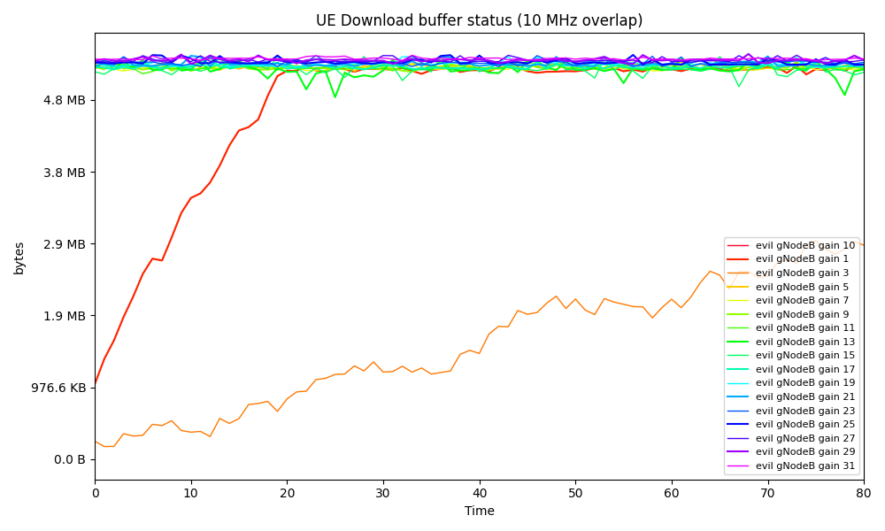
 5 Mhz Overlap       
No Overlap or Buffer 
10 Mhz Buffer        

Full Overlap         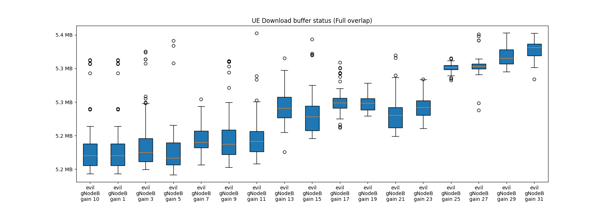
20 Mhz Overlap       
10 Mhz Overlap       
 5 Mhz Overlap       
No Overlap or Buffer 
10 Mhz Buffer        

---

# Experiment #2 (Center Frequency Test)
In this test, the only change is the dl_arfcn values.  Test runs with the default 40MHz bandwidth.  The Good gNodeB runs with a center frequency of 3450 MHz (3430 MHz - 3470 MHz).  The Evil gNodeB starts at 3400 MHz (3380 MHz - 3420MHz) which has a buffer from the good gNodeB of 10MHz.  Then the evil gNodeB's center frequency is adjusted by 2 MHz for each subsequent test towards the good gNodeB's center frequency until they are totally overlapping.  Please note for these plots there is a lot of data.  The box plot gives a better idea.

#### Experiment #2 (Center Frequency Test) - Download Bandwidth

#### Experiment #2 (Center Frequency Test) - CQI
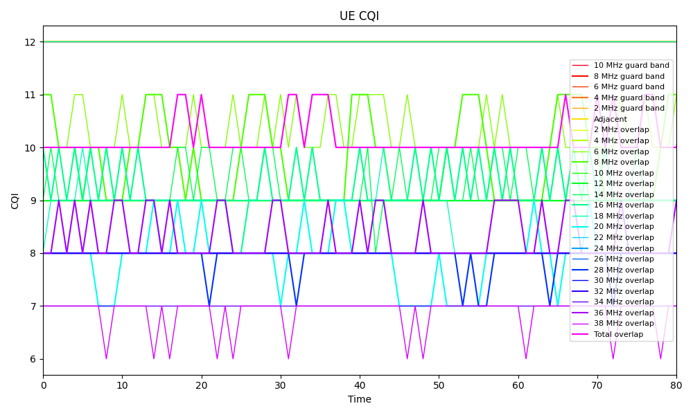

#### Experiment #2 (Center Frequency Test) - MCS

#### Experiment #2 (Center Frequency Test) - PUSCH SINR

#### Experiment #2 (Center Frequency Test) - Rank Indicator

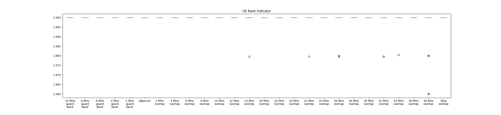

Experiment #2 (Center Frequency Test) - DL Buffer Status
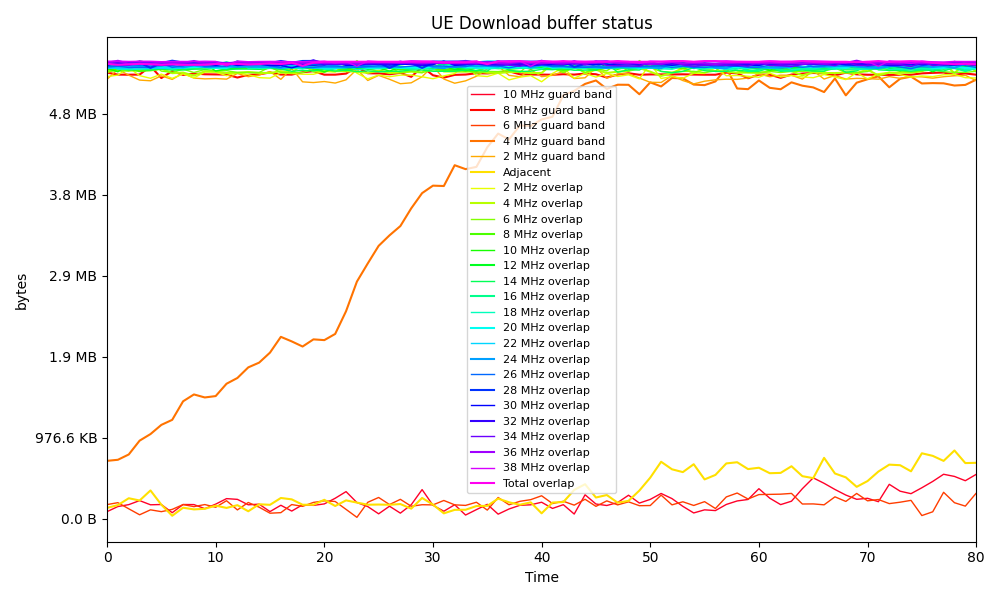
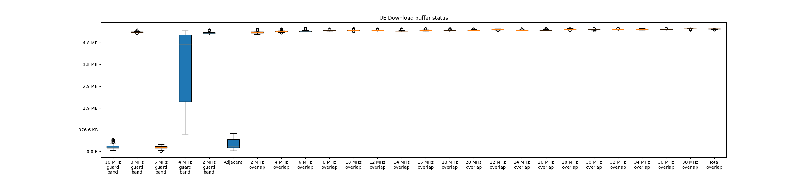

---
# Experiment #3 (TDD Misconfiguration Test)
In this experiment, the TDD configuration for the good gNodeB uses the default 5 download and 4 upload slots (total 9 slots).  Channel bandwidth is 40MHz.  The evil gNodeB's TDD configuration is varied, running each allocation of the ul and download slots (8dl and 1ul, 7dl and 2ul, .....)  NOTE: 1d8u was not a valid mode (evil gNodeB wouldn't start with that setting) and was not ran.

#### Experiment #3 (TDD Misconfiguration Test) - Download Bandwidth
Full Overlap         
20 Mhz Overlap       
10 Mhz Overlap       
 5 Mhz Overlap       
No Overlap or Buffer 
10 Mhz Buffer        

Full Overlap         
20 Mhz Overlap       
10 Mhz Overlap       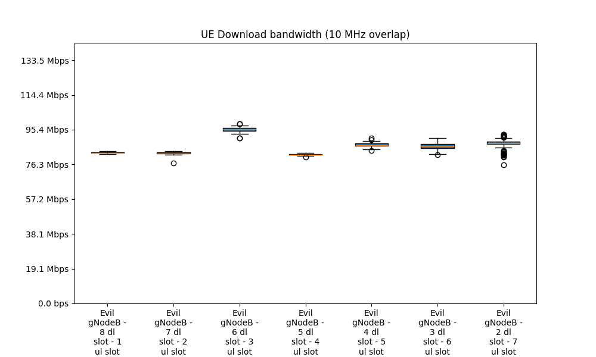
 5 Mhz Overlap       
No Overlap or Buffer 
10 Mhz Buffer        

---
#### Experiment #3 (TDD Misconfiguration Test) - CQI
Full Overlap         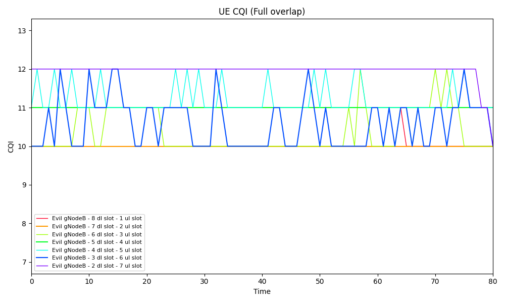
20 Mhz Overlap       
10 Mhz Overlap       
 5 Mhz Overlap       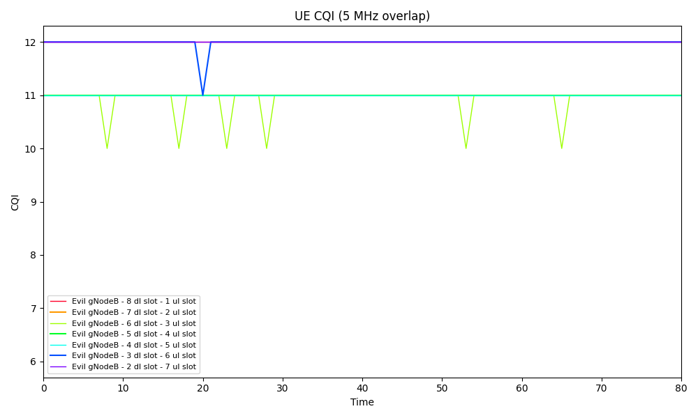
No Overlap or Buffer 
10 Mhz Buffer        

Full Overlap         
20 Mhz Overlap       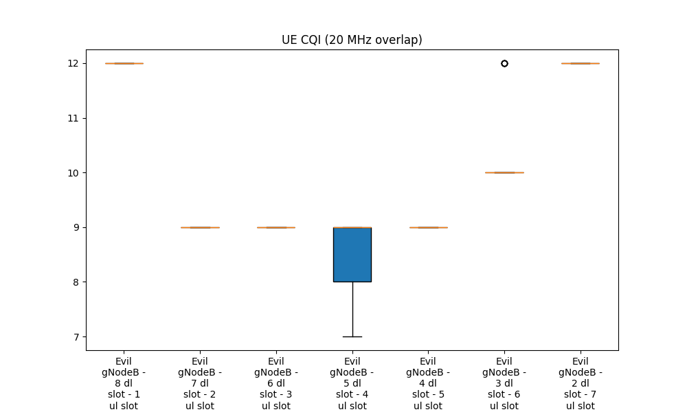
10 Mhz Overlap       
 5 Mhz Overlap       
No Overlap or Buffer 
10 Mhz Buffer        

---
#### Experiment #3 (TDD Misconfiguration Test) - MCS
Full Overlap         
20 Mhz Overlap       
10 Mhz Overlap       
 5 Mhz Overlap       
No Overlap or Buffer 
10 Mhz Buffer        

Full Overlap         
20 Mhz Overlap       
10 Mhz Overlap       
 5 Mhz Overlap       
No Overlap or Buffer 
10 Mhz Buffer        

---
#### Experiment #3 (TDD Misconfiguration Test) - PUSCH SINR
Full Overlap         
20 Mhz Overlap       
10 Mhz Overlap       
 5 Mhz Overlap       
No Overlap or Buffer 
10 Mhz Buffer        

Full Overlap         
20 Mhz Overlap       
10 Mhz Overlap       
 5 Mhz Overlap       
No Overlap or Buffer 
10 Mhz Buffer        

---
#### Experiment #3 (TDD Misconfiguration Test) - Rank Indicator
Full Overlap         
20 Mhz Overlap       
10 Mhz Overlap       
 5 Mhz Overlap       
No Overlap or Buffer 
10 Mhz Buffer        

Full Overlap         
20 Mhz Overlap       
10 Mhz Overlap       
 5 Mhz Overlap       
No Overlap or Buffer 
10 Mhz Buffer        

---
#### Experiment #3 (TDD Misconfiguration Test) - DL Buffer Status
Full Overlap         
20 Mhz Overlap       
10 Mhz Overlap       
 5 Mhz Overlap       
No Overlap or Buffer 
10 Mhz Buffer        

Full Overlap         
20 Mhz Overlap       
10 Mhz Overlap       
 5 Mhz Overlap       
No Overlap or Buffer 
10 Mhz Buffer        
 

---
# Experiment #4 (Center Frequency Test - testing the gap)
In this test, the only change is the dl_arfcn values.  Test runs with the default 40MHz bandwidth.  The Good gNodeB runs with a center frequency of 3450 MHz (3430 MHz - 3470 MHz).  The Evil gNodeB starts at 3406 MHz (3380 MHz - 3420MHz) which has a buffer from the good gNodeB of 10MHz.  Then the evil gNodeB's center frequency is adjusted by 0.4 MHz for each subsequent test towards the good gNodeB's center frequency until it hits 3416.  Please note for these plots there is a lot of data.  The box plot gives a better idea.

#### Experiment #4 (Center Frequency Test) - Download Bandwidth

#### Experiment #4 (Center Frequency Test) - CQI
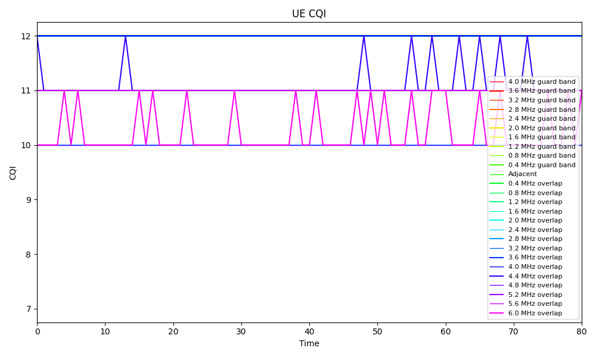

#### Experiment #4 (Center Frequency Test) - MCS

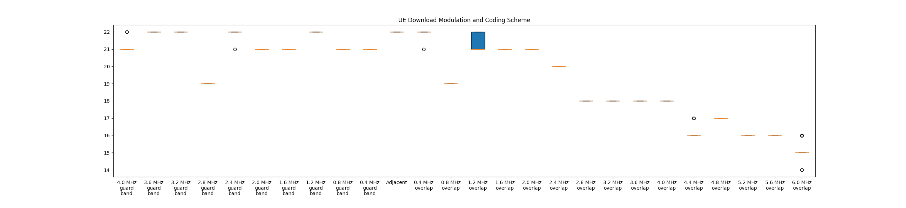

#### Experiment #4 (Center Frequency Test) - PUSCH SINR

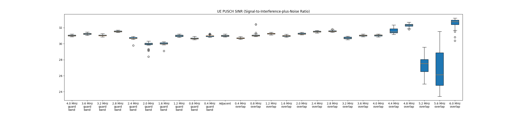

#### Experiment #4 (Center Frequency Test) - Rank Indicator

#### Experiment #4 (Center Frequency Test) - DL Buffer Status

---
# Experiment #5 (TDD CLI test)
In this experiment, the TDD configuration for the good gNodeB uses the default 5 download and 4 upload slots (total 9 slots).  Channel bandwidth is 40MHz.  The evil gNodeB's TDD configuration is varied, running each allocation of the ul and download slots (8dl and 1ul, 7dl and 2ul, .....)  Previous test varied frequency overlap.  This test varies the Evil GnodeB's tx power  (31db, 25db, 20db, 15db, 10db, 5db).

#### Experiment #5 (TDD CLI test) - Download Bandwidth
31db Evil gNodeB Tx Gain    
25db Evil gNodeB Tx Gain    
20db Evil gNodeB Tx Gain    
15db Evil gNodeB Tx Gain    
10db Evil gNodeB Tx Gain    
 5db Evil gNodeB Tx Gain    

31db Evil gNodeB Tx Gain    
25db Evil gNodeB Tx Gain    
20db Evil gNodeB Tx Gain    
15db Evil gNodeB Tx Gain    
10db Evil gNodeB Tx Gain    
 5db Evil gNodeB Tx Gain    

#### Experiment #5 (TDD CLI test) - CQI
31db Evil gNodeB Tx Gain    
25db Evil gNodeB Tx Gain    
20db Evil gNodeB Tx Gain    
15db Evil gNodeB Tx Gain    
10db Evil gNodeB Tx Gain    
 5db Evil gNodeB Tx Gain    

31db Evil gNodeB Tx Gain    
25db Evil gNodeB Tx Gain    
20db Evil gNodeB Tx Gain    
15db Evil gNodeB Tx Gain    
10db Evil gNodeB Tx Gain    
 5db Evil gNodeB Tx Gain    

#### Experiment #5 (TDD CLI test) - MCS
31db Evil gNodeB Tx Gain    
25db Evil gNodeB Tx Gain    
20db Evil gNodeB Tx Gain    
15db Evil gNodeB Tx Gain    
10db Evil gNodeB Tx Gain    
 5db Evil gNodeB Tx Gain    

31db Evil gNodeB Tx Gain    
25db Evil gNodeB Tx Gain    
20db Evil gNodeB Tx Gain    
15db Evil gNodeB Tx Gain    
10db Evil gNodeB Tx Gain    
 5db Evil gNodeB Tx Gain    

#### Experiment #5 (TDD CLI test) - PUSCH SINR
31db Evil gNodeB Tx Gain    
25db Evil gNodeB Tx Gain    
20db Evil gNodeB Tx Gain    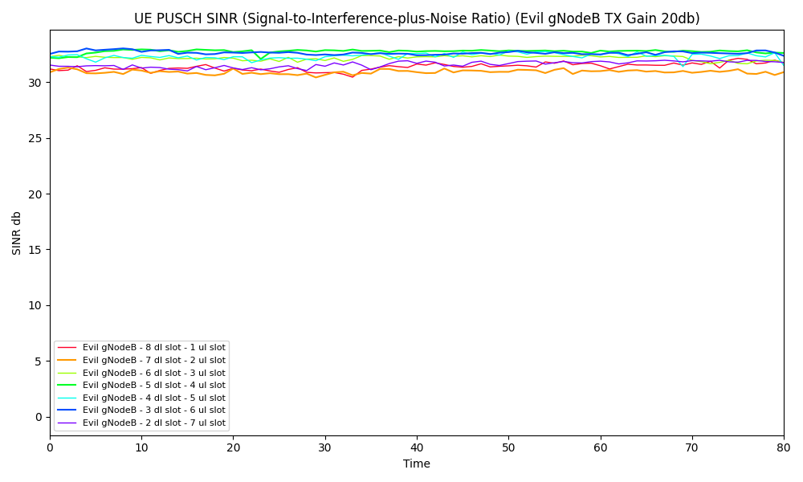
15db Evil gNodeB Tx Gain    
10db Evil gNodeB Tx Gain    
 5db Evil gNodeB Tx Gain    

31db Evil gNodeB Tx Gain    
25db Evil gNodeB Tx Gain    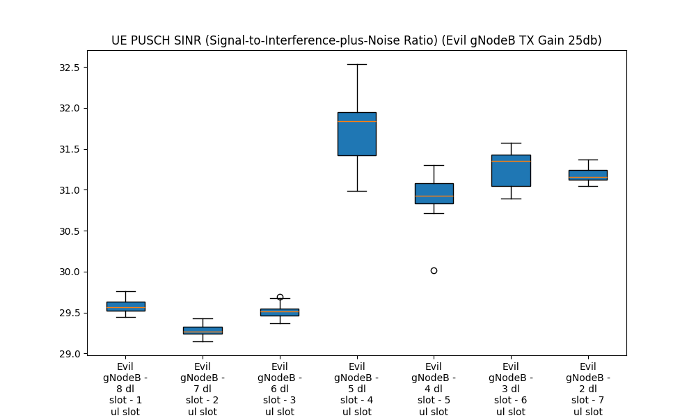
20db Evil gNodeB Tx Gain    
15db Evil gNodeB Tx Gain    
10db Evil gNodeB Tx Gain    
 5db Evil gNodeB Tx Gain    

#### Experiment #5 (TDD CLI test) - Rank Indicator
31db Evil gNodeB Tx Gain    
25db Evil gNodeB Tx Gain    
20db Evil gNodeB Tx Gain    
15db Evil gNodeB Tx Gain    
10db Evil gNodeB Tx Gain    
 5db Evil gNodeB Tx Gain    

31db Evil gNodeB Tx Gain    
25db Evil gNodeB Tx Gain    
20db Evil gNodeB Tx Gain    
15db Evil gNodeB Tx Gain    
10db Evil gNodeB Tx Gain    
 5db Evil gNodeB Tx Gain    

#### Experiment #5 (TDD CLI test) - DL Buffer Status
31db Evil gNodeB Tx Gain    
25db Evil gNodeB Tx Gain    
20db Evil gNodeB Tx Gain    
15db Evil gNodeB Tx Gain    
10db Evil gNodeB Tx Gain    
 5db Evil gNodeB Tx Gain    

31db Evil gNodeB Tx Gain    
25db Evil gNodeB Tx Gain    
20db Evil gNodeB Tx Gain    
15db Evil gNodeB Tx Gain    
10db Evil gNodeB Tx Gain    
 5db Evil gNodeB Tx Gain    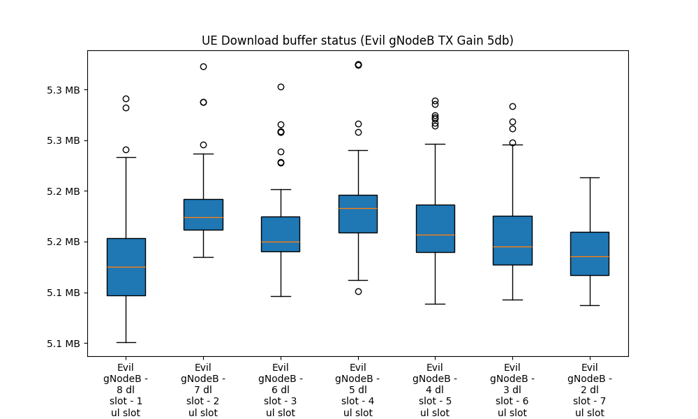

Hopefully all these numbers seem reasonably sane to you.

Mike